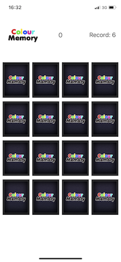
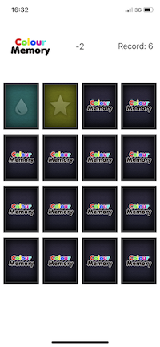
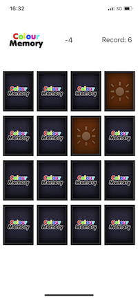
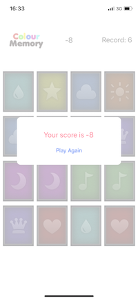

# Match-card-game
A matching card game demo

## Instruction

The game starts initially with all cards facing down. The player can flip two cards each round to find a match.
If the flipped cards is a match, the player receives two points, and the cards will stay opened. 
Otherwise, the cards are turned face down again and the player loses one point. 
This continues until all pairs have been found. 
After the game is finished, the game will show a popup window that displays the score and a message like "New High Score".
Otherwise, you can play it again.

## Demo

